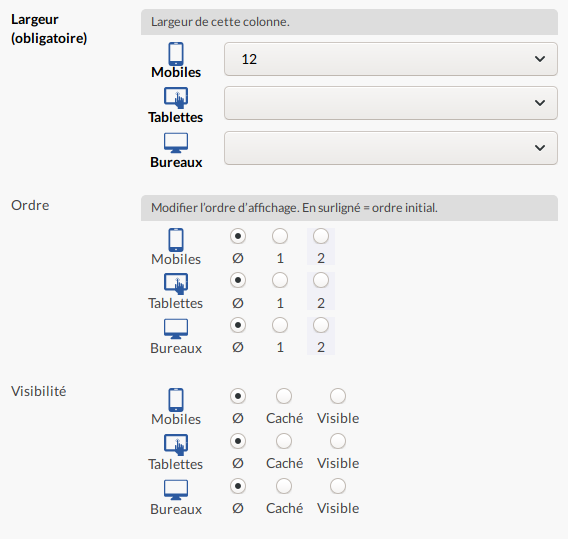

# Noizetier : agencements

Ce plugin étend le noiZetier 3 en ajoutant la prise en charge des grilles CSS.
Couplé à un plugin fournissant une grille CSS telle que [Gridle](https://git.spip.net/plugin/gridle), il permet de gérer l'agencement des noisettes.

## Principe d’une grille CSS

Une grille CSS divise la page en N colonnes virtuelles, généralement 12.

Des blocs conteneurs constituent des « lignes ».

Dans ces lignes, chaque bloc enfant est une « colonne » qui peut s'étendre sur une N colonnes virtuelles.
Leur largeur peut être définie pour chaque breakpoint.


## Utilisation

La noisette « Conteneur » est surchargée, elle est renommée en « Bloc de colonnage ».
Dans le vocabulaire des grilles CSS, c'est donc une « ligne », dont les noisettes enfantes deviennent des « colonnes ».

Chaque noisette « colonne » peut s'étaler sur plusieurs colonnes virtuelles, définissant ainsi sa largeur.

La plupart des grilles CSS permettent l'imbrication, c'est à dire imbriquer une ligne dans une ligne, pour les cas spéciaux.


De nouvelles saisies sont ajoutées à la configuration des noisettes, permettant d'ajuster largeur, alignement, ordre d'affichage, visibilité, etc.
Ces valeurs peuvent être définies pour chaque breakpoint.

Noisette « Bloc de colonnage » :


Noisette enfante :



## Déclaration des grilles

Les plugins souhaitant déclarer une grille CSS doivent procéder ainsi :

### Déclarer la grille

Déclarer l'identifiant de la grille dans le fichier d'options.

```php
if (!defined('_NOIZETIER_GRILLE_CSS')) {
	define('_NOIZETIER_GRILLE_CSS', 'bidule');
}
```

### Feuille de style

Fournir la feuille de style compilée.
Celle-ci peut-être nommée et rangée n'importe-où.

`css/bidule.css`

### Décrire la grille et lister les saisies

Créer un fichier `grillecss/{bidule}.php`.

Il doit contenir 3 fonctions :

1. Une fonction qui décrit la grille : nombre de colonnes, breakpoints, etc.
2. Une fonction qui liste les saisies.
3. Une fonction qui transforme une classe en sa variante pour un breakpoint.

**À finir...**


## Pipelines

### `noizetier_layout_lister_saisies_grille`

Permet de modifier la liste des saisies de la grille CSS.

```php
$saisies_grille = pipeline(
  'noizetier_layout_lister_saisies_grille',
  array(
    'args' => array(
      'grille'      => _NOIZETIER_GRILLE,
      'id_noisette' => $id_noisette,
    ),
    'data' => $saisies_grille,
  )
);
```

### `noizetier_layout_decrire_grille`

Permet de modifier la description de la grille CSS.
On peut par exemple changer le nombre de colonnes ou ajouter des breakpoints dans le cas où la feuille de style est personnalisée.

```php
$grille = pipeline(
  'noizetier_layout_decrire_grille',
  array(
    'args' => array(
      'grille' => _NOIZETIER_GRILLE,
    ),
    'data' => $grille,
  )
);
```

## Feuille de route

1. Permettre un aperçu de l'agencement directement dans l'interface du noizetier